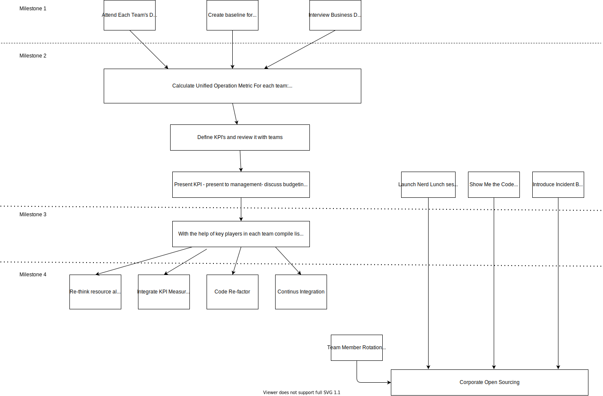

---
fontsize: 10pt
monofontoptions: 'Scale=0.7'
...
# Enterprise Software Lead Engineer - Interview Case Study - Solution
by Zoltan Bacskai

I divided the tasks, which I would carry out into four milestones. Please see Appendix for visual representation.

### Milestone 1

#### Attend Each Team's daily meetings (as obeserver)
* Identify key-players, obvious operational issues, daily operational deficiencies, incompatibilities between team members
* Observations are documented in structured format, which can be shared with team/individuals in f2f meetings by their managers
* This action is carried on for a month or so then vistis may be less frequent

#### Create Baseline For KPI:
* Use code analysis tool to measure KPIs. (selected tool ex: python - multimetric)

##### Proposed KPIs:
``` Code Stability:``` Percentage of code rollback from deployment,
``` Testable Code:``` Measure on Code Coverage (Line coverage to start with),
``` Code Churn:``` Amount of commits in the last 2 days of the sprint,
``` Code Simplicity:``` Cyclomatic Complexity (This number is returned by multimetric),
``` Code Maintainability:``` Number between 0-100 (100 is maintainable. Can be obtained 
by multimetric),
``` Knowledge Sharing:``` Measure documentation ratio, score teams on knowledge sharing activities organised per month,
``` Business Interaction:``` Score on 1-10 - survey to business stakeholder after each 

#### Interview Business Domain Experts
* Understand the profitability/margins of each team's product 

### Milestone 2 

#### Calculate a Unified Operation Metric for each team
* understand human-resourcing issues/complexity/maintainability relates to each other. 
* identify source of sub-optimal productivity
* A metric can be for example (please see chart)

#### Launch nerd-lunch/ Show me the code sessions
* Each team holds a session once a month to present what they are working on

#### Define KPI's and review it with teams
* Discuss what KPI value would be realistic on given budget and commit to quantifiable improvement in KPI

#### Example definiton of KPI values:
 **Code Stability:** In Q2 our code rollback ratio shll be reduced by 3%,
 **Testable Code:** In Q2 No commit with coverage less than 80% can be merged in,
 **Code Churn:** In Q3 the amount of last-minute changes have to be reduced by 50%,
 **Code Simplicity:** In Q1 implement a pull-request hook, which will not enable PRs to be meregd in with cyclometic complexity greater than X,
 **Code Maintainability:** From Q1 No PRs with maintainability index less than 70 can be marged into the code,
 **Knowledge Sharing:** In Q1 team increases documentaion/code ratio by 3%,
 **Business Interaction:** Improve our business feedback score by 5% in the next quarter

#### Present KPI to management
* Getting approval of budget, discuss priorities vs. business objectives. Make decisions on further budgeting if needed. (Hiring, licensing cost of tools, etc.)

### Milestone 3
#### Compile Engineering Health Backlog
* With the help of teams compile an engineering backlog: list painpoints, technical debt, code, which needs to be implemented to reach KPI targets
* Task is completed if all teams have at least 2 Quarters of engineering work in the backlog. (T-Shirt sized) 

### Milestone 4
#### The actual implementation of the actions identified by teams
* Re-think resource allocation, maybe team re-shuffle
* Integrate KPI measures to daily release
* Code re-factoring
* Implementation of contionus integration
* Team member rotation within teams
* Corporate Open sourcing

## Appendix

### Action Plan




The following document can also be found here: https://github.com/zbacskai/eng-case-study.git